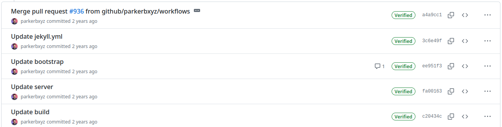

# Git Basics

> [!IMPORTANT]
> This part of the tutorial is mostly about the concepts that you shall learn to work with Git effectively.

## The Commit

**Git** keeps track on changes over a set of files that we mark as relevant to our projects. Whenever we perform a
*commit*, **Git** registers the changes against a previous version of every file that is tracked.

When we add track of a file from our project for the first time, **Git** stores this *version* of the file. Every
time we register a change of such file, **Git** identifies the differences between the previous version of the file
and the fresh one. That means, **Git** only registers those changes, **not the entire file!** This is really convenient
because a continuous register of each version for each file would end in heavy repositories, and a poor use of our
storage backend. Every registered version of each tracked file can be recomposed using the initial version and the
series of registered changes until the version you aim to recover, hence there is no real need to store an image of
the entire file each time you perform a _commit_.

Then, **what is a _commit_**? We can define a _commit_ as an entry in the history record of a project that identifies
the changes between the previous image of a project and the current one.

Let's take a look at a project's history record:

We can identify the following key components:
- **The commit's message**: Usually a short sentence that describes the purpose of the changes.
- **The commit's author**: Every commit needs to identify the author of the changes.
- **A timestamp**: This reference allows ordering the changes by time.
- **A hash**: How do we identify every commit unambiguously? Easy, a hash of the commit is used as identifier. Though
  we usually see a hash composed of 7 alpha-numeric characters, a commit hash includes 40 alpha-numeric characters.
  The main reason for that is to ease user's life. It's much easier to handle 7 characters rather than 40, and the
  chances that a collision would occur in your repository having 2 commits with the same 7 most significant characters
  are really low.
- **A change list**: Changes into existing files are detailed with the information regarding what lines have changed,
  what are added and what are deleted.

Besides those items, a *commit* might also include a full description of the purpose for the changes. However, this
long message is optional, and not all the commits include it. It is advisable to include a longer description of the
changes, since the commit's message doesn't allow to include much information in a single line message.

### How to Group Changes Into a Commit

Despite this topic might seem silly at the beginning, you'll soon discover that is not a trivial subject how to group
changes into *commit*s. The most common way to use **Git** at the beginning is to perform *commit*s every time we
aim to freeze changes into the project's history. We usually add all the changes to the _commit_ and we call it a day.

**However, most of the programmers, sooner or later, find out that is not the best way to organise changes.** Why?
Because of a simple reason: we commit errors most of the time, and sooner or later we detect those errors and we try
to fix them. If we identify a bug was introduced in a particular _commit_, we could simply erase that commit from the
history, vanish those changes, and fix our bug. Sounds well, doesn't it? Now recap what we stated a paragraph ago:
"We usually add all the changes to the _commit_". So erasing a commit would also mean wiping out other changes that
are really useful. Ok, we sort of discover why the concept of **atomicity** is a key aspect on this subject.

#### There Is No Golden Rule

I'll tell you the bad news right away: there's no rule or set of rules that most developers blindly follow to perform
well-structured *commit*s. However, there are a few known rules that most developers agree everybody shall follow
to avoid style-discussions with your project manager or maintainer or colleagues.

The main reason behind not having a standard procedure to add content to *commit*s is the existence of many software
development styles, and how those styles define ***atomic changes***. While some styles encourage to *commit* quite
often, others encourage to _commit_ only when a particular feature is implemented by the set of changes that you'll
include in the *commit*.

The best way to go would be to check what software development style is applied to the project you're part of, and
ask if some style-guide is followed before attempting to do something by your own.

It is also important the context in which you're about to *commit*. It is not the same to *commit* into the *main*
branch than into a personal branch that nobody else uses.

#### A Trade-Off Policy

To conclude this section a few rules are given that, regardless of the sw development style, or context, are advised
to follow:

- **Git is not** a replacement for **Dropbox**, **Google Drive** or alike services. This means it is not advised to
  use **Git** to save content as we do with the previously mentioned services. Sometimes, you might end in the situation
  in which you need to save unfinished code to quickly share something or to run some integration tests, for example.
  Though I don't say never do this, I'd advise to keep this kind of usage to a bare minimum, and try to look for
  alternatives to cope with this situations.
- **Avoid pushing code that doesn't work-compile to widely used branches such as *main* or *devel***. Regardless of how
  many people contribute to a project, it's common to consider the *main* branch as the one that holds the most
  most stable content in a project. Thus pushing unfinished or broken code into such kind of branch would provoke a
  headache to someone (or even you) in the future. Extended this policy to branches whose name is widely use in many
  project, such as *devel*, *proposed_main* or alike. Shared branches are used by many people as the basis to extend
  the existing code. Starting from a broken code is never an enjoyable experience.
- **Avoid mixing logic areas in the same *commit***. If you are forced to include many changes into a single *commit*,
  at least, try to keep some logic coherency, and split changes into *logical areas*. For example, I find reasonable to
  split a feature's implementation and the related testing code into several *commit*s. This way, if I find a bug in
  either the feature's code or the test, I would be able to touch only the affected part, leaving the other *logic*
  part untouched.
- **Avoid verbosity in the *commit*'s brief description whilst be verbose in the long description.** Giving a short
  *commit*'s message is not a bad thing as long as you provide more details in the long description. Also, avoid
  being redundant: the *commit* already says what was changed, thus provide a useful message that improves what is
  already said by those changes. Don't repeat the same _message_ shown by the change list.
- **Avoid binary content**. As we have discussed, **Git** only records the changes between the previous stored versions
  of files and the new versions. This ends in a very efficient mechanism to keep track of changes. However, this is
  not always possible, in particular, **Git** can extract differences in binary files. That means every time you
  add to a *commit* a binary file, it is pushed into the project *as it is*. If you aim to push an *updated version
  of the binary*, the entire binary is pushed again, thus we end having the wight of both binaries. Repeat this process
  several times, and you'll end with a project that weights several hundreds of MB, or even a few GB (believe me, I
  suffered cloning repositories whose weight was a few GB, and it takes for ever). Sometimes, you **really** need to
  add some sort of binary content to your project, so I don't say it is forbidden. Just think twice whether you are
  pushing a binary that will evolve time to time or not. In the former scenario, you better opt for alternative
  ways to store and share such content. For example, [GitHub Packages](https://github.com/features/packages).

### Further Reading

- [Pro Git](https://git-scm.com/book/en/v2), Chapter 2: Git Basics.
