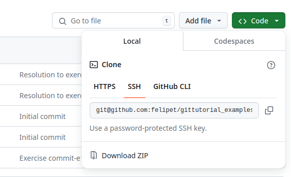

# First Steps with Git

First things first: you need **Git** installed in your computer. If you don't have it, visit the [Installation][installing] section of the Introduction.

This chapter focused on using the tool **git** in Linux. Though there are quite a few capable GUI **Git** clients these days, a basic understanding of the **git** command-line tool is always advisable: imagine that you need to do something with a repository in a graphic-less environment, e.g. while accessing through SSH to a remote computer, what would you do then? The command line client is present almost every where, and it's a bullet-prof solution. Start by understanding things command-line first, and then go for the friendlier GUI client, if you wish to.

## First Time Set-Up

The first time you ever use **Git** in your computer, you'll need to tell **Git** who you are. Every *commit* is signed by an author. This makes possible to track your work across years, projects, jobs etc. Sometimes, you'll sign *commit*s using different email addresses, a common scenario if you worked for several companies. This is not an issue as long as you properly registers those emails as belonged by you in your repository hosting service (GitHub).

Run these pair of commands to register your name and email. I'd advise to be consistent with your name across years and machines.

```bash
$ git config --global user.name "John Doe"
$ git config --global user.email johndoe@example.com
```

Omit `--global` if you wish to apply the changes to the current shell session (useful for doing a quick fix in a remote shared machine). Another interesting setting is the default editor. You can choose your preferred editor, either terminal-based or GUI-based: **Vim**, **Emacs**, **Nano**, **Gnome's text editor**,... there countless choices, but **Nano** offers a good balance between simplicity and features:

```bash
$ git config --global core.editor nano
```

To conclude this section, a tool that everybody eventually needs: a merge conflict editor. Solving merge conflicts is rarely an easy job. That's why choosing a good application to help us out with the selection of the changes is crucial. My choice is [**Meld**](https://meldmerge.org/). But don't hesitate on looking for other alternatives as choosing the right tool for this task is a real time saver.

```bash
$ git config --global merge.tool meld
```

## The **git-clone** And **git-init** Tools

First of all, how can we include **Git** in our project? Or how do we get an existing one?

Let's consider that we have a project that already includes source code or any other type of documents. Until now, it is a regular system's directory that contains files. Whenever we make a change in a file, the previous state of the file is lost. If we aim to keep track of changes, and be able to restore past versions of our files, we need to set up a repository to handle the multiple versions that we eventually will generate. Since we are covering **Git** in this tutorial, we'll set up a **Git** repository, or repo.

To do so, we navigate to the project's root folder in a console and we use the command `git init`. This tool will create a special folder in our project named `.git` that will contain all the metadata and stuff that is needed to run our new fancy repository. From this moment, you are ready to go and you just need to select what files you aim to include in the tracking system. You can use [**git-add**](#the-git-add-and-git-commit-tools) tool for that purpose.

Let's be honest, initializing a repository is not a common task. It's a one-time job for the entire life of a project. The most common scenario is to clone an existing repository of a project, to grab all the source code from an external server (GitHub, Gitlab, ...) to our machine.

### Choosing a Protocol to Clone a Repository

Find a project from GitHub. For the sake of this example, I'll use the examples repository that contains the [examples][example] of this tutorial. If you navigate to the main page of any repository from GitHub, you'll find a green button with the label _code_ close to the top right corner:



In the _Local_ tab, you find 3 options: *HTTPS*, *SSH*, and *GitHub CLI*. In brief, using the *SSH* protocol is the most convenient way to pull and push content to a repository in which we are allowed to access (either we own it, or we are included as developers).

When we aim to grab a public repository in which we have no special access allowance, we need to stick to *HTTPS*. Using *HTTPS* always would seem a killer option as it would work for both public and owned repositories, wouldn't it? The con behind using this protocol is that we'll be required to introduce our access credential every time we attempt an operation that requires special access privileges.

Really annoying, believe me. The third option makes use of a client application developed by GitHub that automates many aspects. It's really handy, and I'd suggest you give it a try. Using *SSH* needs some initial set up, but it's only needed the first time you attempt to use it. So once you configure it, you'll use it for any repo that you need. Also, you can't use *SSH* with public repositories in which you don't have any special access. That's why GitHub's app is so handy.

If you prefer to use the old and well known *SSH*, please follow [Github's guidelines][ssh] in order to set up your access using such protocol. If you rather prefer the new fancy application by GitHub, feel free to follow their [guidelines][gh] to install and configure the app.

Considering that you didn't choose the **gh** tool, you'll need to use **git-clone**. Let's close this section cloning the examples repo:

```bash
$ git clone https://github.com/felipet/gittutorial_examples.git
```

[example]: https://github.com/felipet/gittutorial_examples
[ssh]: https://docs.github.com/en/authentication/connecting-to-github-with-ssh/adding-a-new-ssh-key-to-your-github-account
[gh]: https://cli.github.com/

## The **git-log** Tool

We've got a local copy of a repository, and now, what can I do with it? Let's take a look at the historic of *commit*s:

```bash
$ git log
```

Let's be honest, that output is not the best. This tool includes quite a lot of options that allow you to heavily modify the output of the command to your needs. For example try this options:

```bash
$ git log --graph --abbrev-commit --decorate  --all
```

It is a bit better, isn't it? Still, when it comes to visualize a repository's history, a GUI tool offers a much better user experience. That's why many **Git** GUI clients mostly offer just a visualization of the history. You can install and try [gitg](https://git-scm.com/downloads/guis) as it offers a good balance between simplicity and features.

As an exercise take note of some *commit* hash and/or a branch name from the log. We'll learn how to move across the historic in the next section.

## The **git-switch** And **git-checkout** Tools Part I

We cloned a repository, we took a brief look at its historic of changes, and now, how can we change the current status of the project to match the snapshot of a particular *commit*?

 By default, you are located at **main**'s branch HEAD, which means the latest *commit* of such branch. This is a good starting point, but if you're looking for a really stable version of the project that you just cloned, you should check out whether tags exist in the repo. Tags (ref ???) are just a fancy way to name *commit*s by name rather than by hash. Versions usually receive tags named `vX.Y.Z`. Go ahead and type the following command in the root folder of our project:

```bash
$ git branch -l -a
```

You'll see a few names. Some are preceded by the string `remotes/origin`. That indicates such branch exists in the server in which your repo is stored. If your repo is not included in an external server, you won't see any of those. If you reckon what's **origin**, feel free to jump and read the section ???.

Though **git-switch** was introduced some time ago, it's functionality is redundant to **git-checkout** plus options. As of today, the former is marked as _experimental_ thus we'll omit it during this tutorial, and go for **git-checkout** instead.

**git-checkout** is a swiss-knife tool. You'll see it quite often along this tutorial. If you cloned the example repo, you might only have a single branch: **main**. Let's crate a new one:

```bash
$ git checkout -b new_branch
```

A glimpse of the next section: let's use **git-status** to see how the last command changed our branch to `new_branch`:

```bash
$ git status
```

You should get: `On branch new_branch`. Play around moving across the history of the repo using `git checkout` without the option `-b`. You can use any valid reference. If you took note of some *commit* hash or branch in the previous section, this is the moment to use those references. Every time you move using **git-checkout**, check using **git-status** that you actually moved to a different *commit*. Another proof is that you shall see changes in the directory of the project: some files might disappear, others might get introduced, and the content of the existing ones might change.

## The **git-status** Tool

The **git-status** tool is, most likely, the tool that you'll use the most. You get a glimpse of your repository every time you execute it. It tells you if any file is untracked, what files suffered changes, and what changes are staged. It also provides you information about your current location in the tree.

If you run the command now, you'll get a very little information since no changes have been introduced. Let's move on to the next section. We'll make some changes to the files, and you'll be able to see a full report of **git-status**. Remember that this command is harmless! Don't hesitate to run it any time you need it.

## The **git-add** And **git-commit** Tools

A recap of the _theoretical_ chapter: the *commit* flow is about to add new files to track, and decide what changes shall promote to the stage before we actually make a *commit*.

Using `git add <filename>` we add all the changes of a file to the stage, or the entire file if it was untracked. Once we have added at least a change to the stage, we can run `git commit` to register those changes into a new *commit*. Our editor of choice will show up. The first line is meant to include our brief description of the *commit*'s purpose. After that, feel free to include a more detailed explanation if you find it necessary.

Let's set up our tests project, and go to the first exercise so we can see in action the *status*, *add* and *commit* commands:

If you didn't clone the examples repository during the previous section, it's time to do so:

```bash
$ git clone https://github.com/felipet/gittutorial_examples.git
$ git checkout commit-e1
```

Your ready to go for the first exercise!


### Exercise 1

Checkout the first exercise of the template repository using the tag: ***commit-e1*** if you didn't do so before:

```bash
$ git checkout commit-e1

```

Let's fork a temporal branch to hold our changes for this exercise:

```bash
$ git checkout -b e1
```

And run the helper script to prepare some dummy content:

```bash
$ ./repo_setup.bash
```

You're ready to make your first *commit*! Add all the changes that you find in your project plus the new file that was created. Make a *commit* and compare your branch against the resolution for the exercise. To do so, we can use **git-difftool** to analyse if there's any difference between two commits. In brief, if you did the exercise well, you'll find an empty message meaning no differences were found by **Git**. If you rather get differences between your *commit* and the one proposed as solution, check out the change list from both to detect what could go wrong.

```bash
$ git difftool commit-e1 HEAD
```

When you're done, feel free to delete that temporal branch using this:

```bash
$ git checkout main
$ git branch -D e1
```

If you reached this point with no issues, congrats! Your **Git**-journey has started! Take your time to take a look at the resolution commit. Check out how only changes are registered, and how **Git** informs us about what was changed. You can use the view from [GitHub][gh_commit_view], your preferred GUI client or simply the console:

```bash
git diff commit-r1^!
```

[gh_commit_view]: https://github.com/felipet/gittutorial_examples/commit/a9c33dc8df76521c66b9cb30a69faf44fb5e5d0b

### Exercise 2

This time, we'll practise adding only part of the changes of a file.

Again the same procedure: checkout the commit for this particular exercise and fork a new branch to keep your proposed changes:

```bash
$ git checkout commit-e2
$ git checkout -b e2
```

And run the script to generate changes:

```bash
$ ./repo_setup.bash
```

Go ahead and type `git status`. You'll see that `folder2/file2.txt` suffered changes. Let's take a look at the changes:

```bash
$ git diff folder2/file2.txt
```

We find 2 changes:
- The first line was replaced by another line. Let's say this change fixes a typo that you've found while reading the existing code.
- The second change adds a new paragraph. Let's say this change implements a new feature.

You completed the implementation of your new fancy feature, and you aim to save the changes using a *commit*. What about the other small change? Should it be included in the same commit? It depends. If you're a purist, you shall not mix both things into a single *commit*: One change applies to a fix for a found type, whilst the other change applies to a new feature. Nothing in common between both. **Atomicity** was briefly mentioned in ???. We'll practice adding only some changes using this scenario.

This time, you aim to publish your new implementation, aka the new paragraph, thus stage only that change and make a *commit*! Leave the other change there for another time. If you find typos and other grammar mistakes in a code and you aim to fix them, I'd suggest to focus on such matter, find all you can and group all those fixes into a single *commit*. That'd be a perfectly scoped *commit*!.

You can accomplish this exercise using your GUI client of choice or the command-line. A hint if you go for the command-line: instead of using `git add <file>` use `git add -p <file>`. That option will enable a dynamic selection of the edited chunks of code for the file. To complete this exercise, you'll have to select the option `e` for a manual edit. Take your time, read the guidelines given by **git-add** and don't hesitate to try things as you can't really break anything!

```bash
$ git difftool commit-e2 HEAD
```

Again you shall see no differences. But this time, if you check out the status of the project, you shall see that you have a modified file (`folder2/file2.txt`).

Let's try to get back to the main branch. Something odd happened. **Git** tells us that our changes to the file `folder2/file2.txt` would be overwritten by this move, i.e. we'd lost those changes. We'll play a wildcard this time using `git stash`, we'll deal with this situation later on.

```bash
$ git stash save "unfinished stuff"
$ git checkout main
```