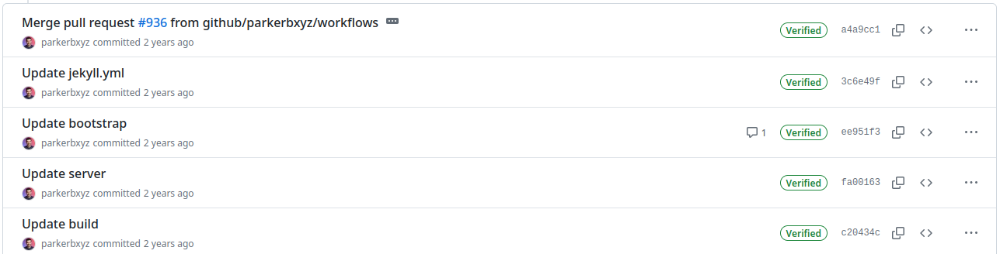
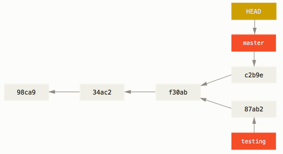

# Git Basics

> [!IMPORTANT]
> This part of the tutorial is mostly about the concepts that you shall learn to work with Git effectively.

## The Commit

**Git** keeps track on changes over a set of files that we mark as relevant to our projects. Whenever we perform a
*commit*, **Git** registers the changes against a previous version of every file that is tracked.

When we add track of a file from our project for the first time, **Git** stores this *version* of the file. Every
time we register a change of such file, **Git** identifies the differences between a previous version (not necessarily
the previous one) of the file and the fresh one. That means, **Git** only registers those changes,
**not the entire file!** This is really convenient because a continuous storage of each version for each file would end
in heavy repositories, and a poor use of our storage backend. Every registered version of each tracked file can be
recomposed using the initial version and the series of registered changes until the version you aim to recover, hence
there is no real need to store an image of the entire file each time you perform a _commit_.

Then, **what is a _commit_**? We can define a _commit_ as an entry in the history record of a project that generates
a snapshot of the state of the project. When a file includes changes between the parent _commit_ and the current
status, **Git** stores only the changes to the file. When a file remains untouched, it simply points to the _commit_
that includes for the first time the current state of the file. It also identifies the parent _commit_. This
is very useful to reconstruct the full history tree of our project. So that's it (broadly speaking): a series of
references to files and changes, and references to the parent *commit*s (some special scenarios might produce two
ancestor *commits* rather than only one).

Let's take a look at a project's history record:

We can identify the following key components:
- **The commit's message**: Usually a short sentence that describes the purpose of the changes.
- **The commit's author**: Every commit needs to identify the author of the changes (plus his/her email).
- **A timestamp**: This reference allows ordering the changes by time.
- **A hash**: How do we identify every commit unambiguously? Easy, a hash of the commit is used as identifier. Though
  we usually see a hash composed of 7 alpha-numeric characters, a commit hash includes 40 alpha-numeric characters.
  The main reason for that is to ease user's life. It's much easier to handle 7 characters rather than 40, and the
  chances that a collision would occur in your repository having 2 commits with the same 7 most significant characters
  are really low.
- **A change list**: Changes into existing files are detailed with the information regarding what lines have changed,
  what are added and what are deleted.

Besides those items, a *commit* might also include a full description of the purpose for the changes. However, this
long message is optional, and not all the commits include it. It is advisable to include a longer description of the
changes, since the commit's message doesn't allow to include much information in a single line message.

### How to Group Changes Into a Commit

Despite this topic might seem silly at the beginning, you'll soon discover that is not a trivial subject how to group
changes into *commit*s. The most common way to use **Git** at the beginning is to perform *commit*s every time we
aim to freeze changes into the project's history. We usually add all the changes to the _commit_ and we call it a day.

**However, most of the programmers, sooner or later, find out that is not the best way to organise changes.** Why?
Because of a simple reason: we commit errors most of the time, and sooner or later we detect those errors and we try
to fix them. If we identify a bug was introduced in a particular _commit_, we could simply erase that commit from the
history, vanish those changes, and fix our bug. Sounds well, doesn't it? Now recap what we stated a paragraph ago:
"We usually add all the changes to the _commit_". So erasing a commit would also mean wiping out other changes that
are really useful. Ok, we sort of discover why the concept of **atomicity** is a key aspect on this subject.

#### There Is No Golden Rule

I'll tell you the bad news right away: there's no rule or set of rules that most developers blindly follow to perform
well-structured *commit*s. However, there are a few known rules that most developers agree everybody shall follow
to avoid style-discussions with your project manager or maintainer or colleagues.

The main reason behind not having a standard procedure to add content to *commit*s is the existence of many software
development styles, and how those styles define ***atomic changes***. While some styles encourage to *commit* quite
often, others encourage to _commit_ only when a particular feature is implemented by the set of changes that you'll
include in the *commit*.

The best way to go would be to check what software development style is applied to the project you're part of, and
ask if some style-guide is followed before attempting to do something by your own.

It is also important the context in which you're about to *commit*. It is not the same to *commit* into the *main*
branch than into a personal branch that nobody else uses.

#### A Trade-Off Policy

To conclude this section a few rules are given that, regardless of the sw development style, or context, are advised
to follow:

- **Git is not** a replacement for **Dropbox**, **Google Drive** or alike services. This means it is not advised to
  use **Git** to save content as we do with the previously mentioned services. Sometimes, you might end in the situation
  in which you need to save unfinished code to quickly share something or to run some integration tests, for example.
  Though I don't say never do this, I'd advise to keep this kind of usage to a bare minimum, and try to look for
  alternatives to cope with this situations.
- **Avoid pushing code that doesn't work-compile to widely used branches such as *main* or *devel***. Regardless of how
  many people contribute to a project, it's common to consider the *main* branch as the one that holds the most
  most stable content in a project. Thus pushing unfinished or broken code into such kind of branch would provoke a
  headache to someone (or even you) in the future. Extended this policy to branches whose name is widely use in many
  project, such as *devel*, *proposed_main* or alike. Shared branches are used by many people as the basis to extend
  the existing code. Starting from a broken code is never an enjoyable experience.
- **Avoid mixing logic areas in the same *commit***. If you are forced to include many changes into a single *commit*,
  at least, try to keep some logic coherency, and split changes into *logical areas*. For example, I find reasonable to
  split a feature's implementation and the related testing code into several *commit*s. This way, if I find a bug in
  either the feature's code or the test, I would be able to touch only the affected part, leaving the other *logic*
  part untouched.
- **Avoid verbosity in the *commit*'s brief description whilst be verbose in the long description.** Giving a short
  *commit*'s message is not a bad thing as long as you provide more details in the long description. Also, avoid
  being redundant: the *commit* already says what was changed, thus provide a useful message that improves what is
  already said by those changes. Don't repeat the same _message_ shown by the change list.
- **Avoid binary content**. As we have discussed, **Git** only records the changes between the previous stored versions
  of files and the new versions. This ends in a very efficient mechanism to keep track of changes. However, this is
  not always possible, in particular, **Git** can extract differences in binary files. That means every time you
  add to a *commit* a binary file, it is pushed into the project *as it is*. If you aim to push an *updated version
  of the binary*, the entire binary is pushed again, thus we end having the wight of both binaries. Repeat this process
  several times, and you'll end with a project that weights several hundreds of MB, or even a few GB (believe me, I
  suffered cloning repositories whose weight was a few GB, and it takes for ever). Sometimes, you **really** need to
  add some sort of binary content to your project, so I don't say it is forbidden. Just think twice whether you are
  pushing a binary that will evolve time to time or not. In the former scenario, you better opt for alternative
  ways to store and share such content. For example, [GitHub Packages](https://github.com/features/packages).
- Broadly speaking, **don't add generated files**. You should only add genuine content to the tracked files. Generated
  files should be easily reproducible using the genuine content of your project plus some guidelines. Sometimes, when
  the building process takes a considerable amount of time, people include final binaries. Remember, there exist
  better alternatives to **Git** to store and share such type of content.

## Commit Flow

Reached this point there's only one missing topic to discuss about *commit*s, what do I need to make one? Committing
changes is a process about selecting what changes you aim to register, and what changes shall remain unregistered.

### Status of a Project's Directory

Before we need to introduce how changes are categorized by **Git**. Consider the root directory of your project at a
given moment in time. The first way to categorize files in your project is whether they are tracked by **Git** or not.
Remember that **Git** stores changes only on tracked files. Eventually, you might introduce new files into your
project. **Git** will tell you those files exist somewhere in your project's directory. Until you explicitly add an
untracked file, it will stay there forever, appearing as a new file, thus changes that you might apply to such files
are not really tracked.

You can configure **Git** to *ignore* certain type of files or complete paths in your project. This is really useful as
it is really annoying to find tens or hundreds of untracked files when you have log files, or build directories.
Find instructions to set up this feature in ???.

Add new files to track whenever you need it, it's not a big deal. Considering files that were tracked before, we get
notified when **Git** detects that any of those include changes respect to the parent *commit*. If you aim to register
a change, you have to promote it to the ***stage***. The stage is the _place_ where git collects all the changes that
were marked as ready to be included in the next *commit*. Which means, whenever you make a *commit* all those staged
changes get registered as the changes of the *commit* whilst changes that were out of the stage remain unregistered.

Briefly, **Git** stablish 3 categorizes (plus one): untracked files, modified files, and staged files. Moving files
between those categories is the daily routine using **Git**. The extra category is a special one, which is not
straightly related to a *commit*'s flow, is called the ***stash***. Consider this as a *limbo* for changes. Sometimes
you need to preserve some unfinished changes, but you are not ready to *commit* them. Here is where the stash plays
a key role. You can send all your changes (staged or not) there, and leave your project in a tidy status. After you
do your stuff, you recover your changes from the stash and you continue your previous job. Read more details of the
stash in the Advance chapter ??? .

## Making a Commit

Once you've got a grasp on the different categories **Git** applies to files, making a *commit* is an easy job. You
just ned to select what changes or new files shall be included into the *commit*, and when everything is ready,
using some of the available tools, you make a new *commit*. Remember the rules mentioned before for the brief message
and long message.

There's no rush to *commit* after you stage some change. In fact, you can change your mind and remove from the stage
a change if you need to. Sometimes, you'll find that some of the changes of a file don't really match the scope of the
*commit* you're about to make. For instance, you are about to fix a bug in your code, and by the way, you found a few
typos in the docs. Should you group both changes into the same *commit*? Ideally you shouldn't. There are two clearly
different scopes for your changes: fixing a bug and fixing a typo. If for some reason one of the proposed changes don't
pass the filter of the review performed during a merge request process, you can simply take it out if you made a good
scope splitting in your *commit*s. If you didn't you'll have to manually take out some code changes, do another
commit and push it to pass the review.

For that scenario, most tools offer the possibility of staging only parts of the file's changes rather than the entire
set of changes at once. Check that out in the *hands-on* chapter!

### Further Reading

- [Pro Git](https://git-scm.com/book/en/v2), Chapter 2: Git Basics.

## The Branch

A branch is, together with the *commit*, one of the most important features of **Git**. It allows to organise *commit*s
into several *logic* areas or contexts.

To clarify this definition, let's consider an example in which a project's development distinguish between two
development contexts: stable code and development code. The former context identifies code that is ready for
production; the latter code that is currently being developed, and might contain unfinished stuff and potential bugs.
How do we tell easily to other people what part of the code is considered stable and what is not? Easy, using branches.
We could define two branches: **main** and **devel** for this purpose. This way, whenever someone access our code,
it is clearly stated that code within the branch **main** is considered stable, and within **devel** is not.

**Git** branches are pointers to *commit*s of our project. Since our project already features a hierarchical structure
thanks to *commit*'s pointers to ancestors, branches don't need to do anything special, just point to the last
*commit* that is included in the branch. We can track all the *commit*s that belong to the branch just following these
ancestor link of the *commit*s until we reach a *commit* that is associated as the latest one of another branch.

This mechanism is pretty efficient, which means we shall no worry about having many branches as they are cheap! Use
as many as you wish, but consider that the more branches you add, the more difficult your project will be to manage.

### Branch Organisation

We already mentioned the **main** branch. You'll see that name quite often. Almost every project includes such name
for the *stable* code. Old projects might include the branch **master** instead of **main**. Some years ago, the
naming system suffered changes to avoid discriminatory words. So don't panic if you can't find the branch **main** in
old projects! The word *main* and the associated branch has nothing special. We could have use the word *favourite*
to name the principal branch of our project. This is up to you. However, you'll find that most developers follow the
rule of naming **main** the principal branch of a project. This is a useful hint for external people to a project to
easily identify *stable* code.

The term stable was always in italics, why? The rule of having only stable code that is ready to use by other people
in the **main** branch is not a must. While some developers only include stable code that is ready to be released
in the **main** branch, other developers don't distinguish at all any context in their projects, and include all the
code (ready or not) within a single **main** branch.

The most common scenario when we aim to use the code from a project's repository is that we are offered the **main**
branch in the repository's main page. Feel free to explore several repositories in GitHub. Above the file list of the
repository, you'll find a dropdown menu with **main** preselected as the branch. Hence naming **main** the principal
branch is not mandatory, it is advised to do so, as you'll provide very useful information to other developers when
they reach your code.

Besides this rule, we can't identify many more advised rules that we should follow. As it happens with how to organise
what content should be included in a single *commit*, the naming policy for the branches greatly depends on your sw
development style.

One of the most used workflows is [GitFlow][gitflow]. It differentiates several categories for the branches:

- **main** for stable released code.
- **develop** for the common development branch.
- **<feature>** with *feature* as the name of the feature you're aiming to implement in such branch.

This workflow makes a very tidy categorisation of the code, but it also has cons as being harder to understand
for beginners and heavy to maintain.

As final thought for this section, I'd advise you to always ask the maintainer of your project what naming schema you
shall follow. If you're developing your own project, feel free to use whatever fits you best: if you aim to develop
something quick with no hustle, push everything into the **main** branch. If you love to categorise things, go for
some alike flow to **GitFlow**.

[gitflow]: https://www.atlassian.com/git/tutorials/comparing-workflows/gitflow-workflow

### Fork and Merge

The most common operations that you'll do with branches are: fork and merge. The former refers to the process in which
a new branch is created. You take a particular *commit* as the ancestor and you diverge a new branch from it. The
latter is the opposite process: two branches that share a common ancestor, i.e. one was forked from the other, join
their content into a single (merge) *commit*.

Forking a branch has no mystery at all: you select the *commit* that will be use as ancestor of the first *commit* of
the new branch, and, whenever you perform the first *commit* of the new branch, the fork will be completed. Consider
the following example taken from the book Pro Git:

We can identify two branches there: **master** (there it goes an example of the old naming system) and **testing**.
Both share a common ancestor: ***f30ab***. From that *commit* downwards, we consider the rest of the *commit*s to
belong to the **master** branch because in our logic organisation of the project's context, **master** scores higher
in the importance hierarchy of our branch naming system.

Sooner or later, you'll need to merge a branch into another. It is crucial to properly understand this mechanism.
Imagine that in our former example, **testing** evolves adding several new *commit*s that implement a new feature.
When the new feature is considered as done, the most common use case would be to merge the content of the branch
**testing** into the branch **master**. This way, the new feature will be exposed as *stable*.

When we attempt to merge content, **Git** evaluates the changes respect to the common ancestor for both the top of
the branch **master** and **testing**. Sometimes the common ancestor is the target *commit* for the merge. This
scenario is the easiest one, and it usually don't provoke issues in the merge. However, when both branches diverge
from the common ancestor, **Git** has to perform a *three-way* merge. Quite often this scenario provokes conflicts:
A piece of code in the ancestor was modified on both sides of the merge, what change should prevail? **Git** is really
good at doing its job, but it can't read your mind (yet). Thus human intervention will be required to resolve the
conflict.

Fork and merge will be in your daily routine: when you get assigned a new task, you, most likely, will fork an existing
branch, do your job, and ... Merge, wasn't it? Maybe not. Performing a merge is usually a tricky task, that's why
experience team mates usually get assigned this task. Forking is a relatively harmless thing, but consider that when
you merge your changes into another branch, you can break pieces of code that others relay on. That's why unless you're
working on your onw in a project, merges are usually requested. Somebody else gets assigned the task of reviewing your
changes and approve the final merge. Even if you are working on your own, it is advisable to open *merge requests*
rather than going straight for a manual merge to force you to read twice your changes, and double-check if your changes
meet the chosen quality standards: tests are passing, code is documented,...

Besides these two operations, there exists other advance operations such as the *rebase* that you can apply to
branches. However, these are more advanced techniques, i.e. a bad use ends in a pretty big disaster, so they are
included in the advanced part of this tutorial.

### Further Reading

- [Pro Git](https://git-scm.com/book/en/v2), Chapter 3: Git Branching.

